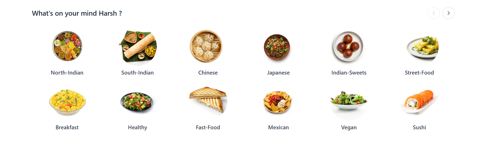
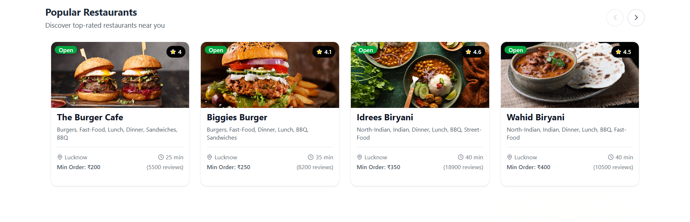
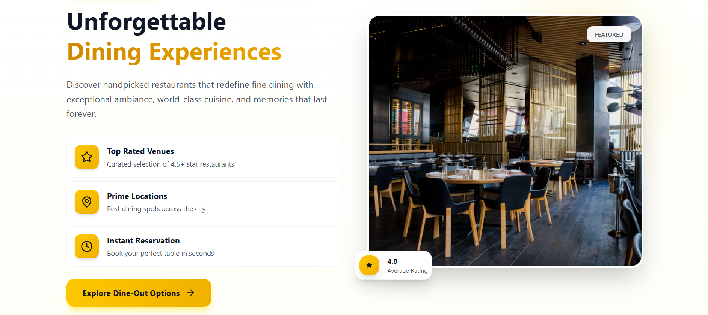
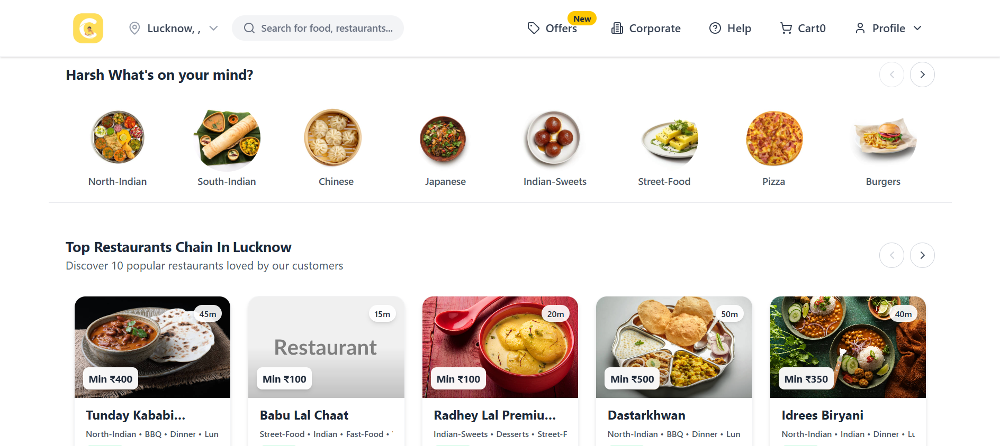
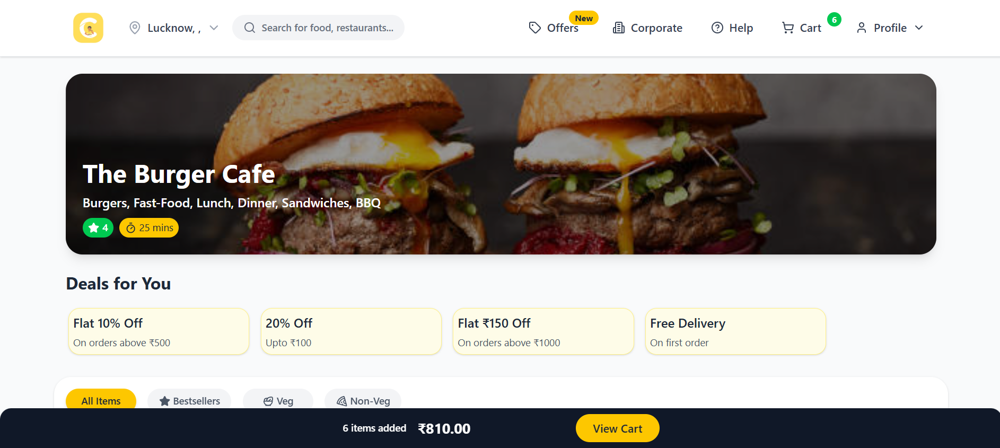
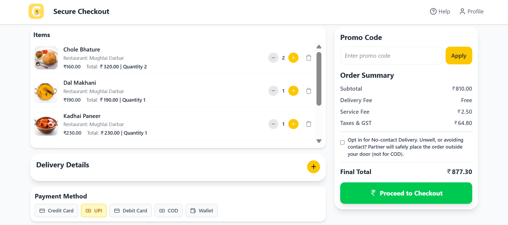
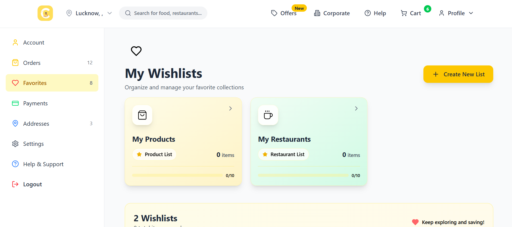
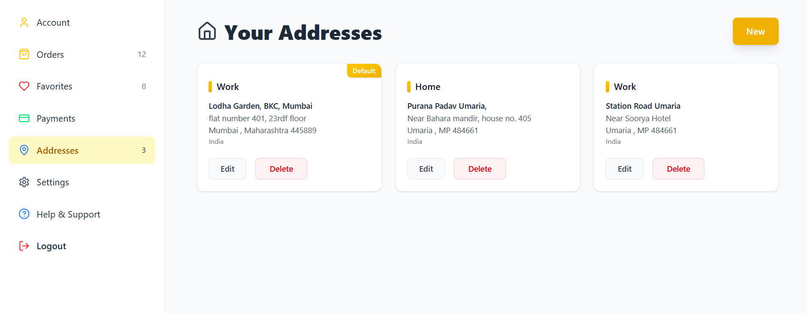
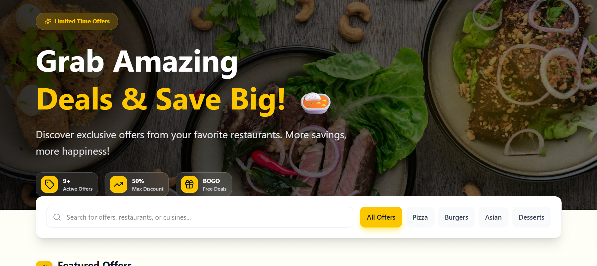

# Cravo - Your Favorite Food, Delivered Fast

<div align="center">
  
  <h3>Order Food. Discover Restaurants. Experience Excellence.</h3>
  <p>
    <strong>Live Demo:</strong> <a href="https://cravo.online">cravo.online</a> • 
    <strong>GitHub:</strong> <a href="https://github.com/believeharsh/Cravo">believeharsh/Cravo</a>
  </p>
</div>

---

## 📋 Table of Contents

- [About](#about)
- [Features](#features)
- [Tech Stack](#tech-stack)
- [Screenshots](#screenshots)
- [Installation](#installation)
- [Configuration](#configuration)
- [Getting Started](#getting-started)
- [Project Structure](#project-structure)
- [Key Highlights](#key-highlights)
- [Future Enhancements](#future-enhancements)
- [Contributing](#contributing)
- [License](#license)

---

## 🎯 About

**Cravo** is a full-stack, production-ready food delivery web application built with the MERN stack. It enables users to explore restaurants, browse menus, place orders securely, and enjoy a seamless food delivery experience. With an intuitive UI/UX design, advanced features like AI-powered recommendations, and robust payment integration, Cravo delivers a world-class user experience.

**Built in:** 3 months | **Project Type:** Solo Project

---

## ✨ Features

### 🏠 User Experience

- **Beautiful Landing Page** – Location-based search with interactive category filtering
- **Smart Location Detection** – Automatic IP-based location fetching for first-time visitors
- **Top Restaurants Slider** – Trending restaurants organized by category with smooth carousel navigation
- **Responsive Design** – Fully optimized for desktop, tablet, and mobile devices

### 🔐 Authentication & Security

- **Manual Authentication** – Secure login and sign-up with password hashing
- **Google OAuth Integration** – One-click sign-up and login with Google
- **Silent Login System** – Automatic login using refresh tokens (30-day validity) with Axios interceptors
- **Guest Checkout** – Browse and order without creating an account

### 🍽️ Restaurant & Menu Management

- **Dedicated Restaurant Pages** – Complete menu viewing with high-quality images
- **Advanced Filtering** – Filter by price, delivery time, dietary preferences (veg/non-veg), best sellers, and ratings
- **Infinite Scroll Loading** – Smooth, efficient loading of restaurant listings
- **Dine-Out Feature** – Support for both delivery and dine-in services
- **Category Results Page** – Dedicated pages for category-based restaurant searches
- **15+ Cities Supported** – Extensive coverage with 1,500+ restaurants and 25,000+ products seeded

### 🛒 Cart & Checkout

- **Secure Cart Functionality** – Real-time cart management with Redux Toolkit
- **Quantity Control** – Adjust item quantities directly from the cart without page navigation
- **Secure Checkout** – PCI-compliant payment processing
- **Guest Checkout** – Complete purchases without mandatory registration
- **Address Management** – Save and reuse multiple delivery addresses

### ❤️ Personalization

- **Multi-Profile Dashboard** – Comprehensive user profile with:
  - Account Information & Settings
  - Favorites (Wishlist) Management
  - Saved Addresses
  - Payment Methods
  - Complete Order History with Status Tracking
- **Dual Wishlists** – Default wishlists for items and restaurants
- **Custom Wishlists** – Create and organize custom wishlists for better personalization

### 💳 Payments & Notifications

- **Razorpay Integration** – Secure payment gateway supporting multiple payment methods
- **Email Notifications** – Real-time updates on orders, offers, and account activities via Resend
- **Offers & Deals** – Dedicated page showcasing current promotions and discounts
- **Corporate Page** – B2B features for corporate partnerships

### 🤖 AI & Smart Features

- **AI-Powered Recommendations** – Intelligent suggestions based on user activity and preferences
- **Smart Filtering** – Advanced search and filtering capabilities
- **Personalized Experience** – Dynamic content based on user behavior

### 📞 Support

- **Help & Support Center** – Comprehensive FAQs and support resources
- **Email Support** – Direct communication channel for user inquiries

---

## 🛠️ Tech Stack

### Frontend

- **React** – UI library for building interactive components
- **Tailwind CSS** – Utility-first CSS framework for responsive design
- **Redux Toolkit** – State management for complex application state
- **Axios** – HTTP client for API calls
- **React Router** – Client-side routing

### Backend

- **Node.js** – JavaScript runtime
- **Express.js** – Web application framework
- **MongoDB** – NoSQL database for flexible data storage
- **Mongoose** – MongoDB object modeling

### External Services

- **Cloudinary** – Cloud-based image and asset management
- **Razorpay** – Payment gateway for secure transactions
- **Resend** – Email service for transactional and marketing emails
- **Google Cloud** – OAuth 2.0 authentication

### Development Tools

- **Husky** – Git hooks for enforcing code quality
- **ESLint** – Code linting for maintaining code standards
- **Git** – Version control

### Deployment

- **Render** – Cloud platform for hosting the application
- **Custom Domain** – cravo.online

---

## 📸 Screenshots

<div align="center">

### Landing Page






### Restaurant Discovery



### Restaurant Menu



### Smart Cart



### Profile Favorites Page



### Order History


### Address Management



### Offers & Deals



</div>

---

## 🚀 Installation

### Prerequisites

- Node.js (v14 or higher)
- npm or yarn
- MongoDB instance
- Git

### Clone the Repository

```bash
git clone https://github.com/believeharsh/Cravo.git
cd Cravo
```

### Install Dependencies

```bash
# Install all dependencies
npm install
```

### Environment Configuration

Create `.env` files in both frontend and backend directories with the following credentials:

#### Backend `.env` Configuration

```env
# Database
MONGODB_URI=your_mongodb_connection_string

# Cloudinary
CLOUDINARY_CLOUD_NAME=your_cloudinary_cloud_name
CLOUDINARY_API_KEY=your_cloudinary_api_key
CLOUDINARY_API_SECRET=your_cloudinary_api_secret

# Email Service (Resend)
RESEND_API_KEY=your_resend_api_key

# Payment Gateway (Razorpay)
RAZORPAY_KEY_ID=your_razorpay_key_id
RAZORPAY_KEY_SECRET=your_razorpay_key_secret

# Google OAuth
GOOGLE_CLIENT_ID=your_google_client_id
GOOGLE_CLIENT_SECRET=your_google_client_secret

# JWT
JWT_SECRET=your_jwt_secret_key
REFRESH_TOKEN_SECRET=your_refresh_token_secret

# Server
PORT=5000
NODE_ENV=development
```

#### Frontend `.env` Configuration

```env
# API
VITE_API_URL=http://localhost:5000/api
VITE_RAZORPAY_KEY_ID=your_razorpay_key_id
VITE_GOOGLE_CLIENT_ID=your_google_client_id
```

### Setup Instructions

1. **Configure MongoDB URI** – Add your MongoDB connection string to the backend `.env` file
2. **Setup Cloudinary** – Create a Cloudinary account and add your credentials
3. **Setup Resend** – Register for Resend email service and add your API key
4. **Configure Google OAuth** – Create OAuth credentials in Google Cloud Console
5. **Setup Razorpay** – Add your Razorpay API keys for payment processing
6. **Install Dependencies** – Run `npm install` in both frontend and backend directories

---

## 🎯 Getting Started

### Start Development Server

```bash
# Backend (from backend directory)
npm run dev

# Frontend (from frontend directory)
npm run dev
```

The application will be available at `http://localhost:5173` (frontend) and `http://localhost:5000` (backend).

### Running with Code Quality Tools

```bash
# Run ESLint to check code quality
npm run lint

# Husky hooks will automatically run on commit to ensure code standards
```

### Production Build

```bash
# Frontend build
npm run build

# Backend is ready for deployment as-is
```

---

## 📁 Project Structure

```
Cravo/
├── frontend/
│   ├── src/
│   │   ├── components/
│   │   ├── pages/
│   │   ├── redux/
│   │   ├── hooks/
│   │   ├── utils/
│   │   └── App.jsx
│   ├── tailwind.config.js
│   └── package.json
├── backend/
│   ├── routes/
│   ├── models/
│   ├── controllers/
│   ├── middleware/
│   ├── utils/
│   └── server.js
├── .gitignore
└── README.md
```

---

## 🌟 Key Highlights

### Impressive Data Seeding

- **1,500+ Restaurants** – Carefully curated and seeded across 15+ cities
- **25,000+ Menu Items** – Comprehensive product database with high-quality images
- **Custom Seeding Scripts** – Efficient data population scripts for easy database initialization

### Advanced State Management

- Redux Toolkit for complex state handling
- Efficient re-render optimization
- Real-time cart synchronization

### Production-Ready Authentication

- Secure password hashing
- JWT-based authentication with refresh tokens (30-day validity)
- Automatic silent login with Axios interceptors
- OAuth 2.0 integration with Google

### Scalable Architecture

- Modular component structure
- Separation of concerns (MVC pattern in backend)
- Reusable utility functions
- Clean and maintainable codebase

### Code Quality Standards

- Husky integration for git hooks
- ESLint configuration for code consistency
- Automated code formatting on commits
- Best practices for error handling and validation

### User Experience Excellence

- Mobile-first responsive design
- Infinite scroll for better performance
- Optimized image loading via Cloudinary
- Intuitive navigation and information architecture
- Light theme design for food delivery context

---

## 🔮 Future Enhancements

- **Real-time Order Tracking** – Live GPS tracking for delivery personnel
- **Restaurant Dashboard** – Admin panel for restaurant owners to manage menus and orders
- **Advanced Analytics** – User behavior tracking and personalized insights
- **Push Notifications** – Mobile push notifications for order updates
- **Multi-language Support** – Internationalization (i18n) for global reach
- **Reviews & Ratings** – Comprehensive review system with photos
- **Loyalty Program** – Points and rewards system for frequent users
- **Admin Dashboard** – Centralized management of restaurants, users, and orders

---

## 🤝 Contributing

This is a personal portfolio project. However, feedback and suggestions are welcome! Feel free to open issues or reach out with recommendations for improvements.

---

## 📄 License

This project is open source and available under the MIT License.

---

<div align="center">
  <p>
    <strong>Built with ❤️ by Harsh Believe</strong>
  </p>
  <p>
    <a href="https://github.com/believeharsh">GitHub</a> • 
    <a href="https://cravo.online">Live Demo</a> • 
    <a href="https://github.com/believeharsh/Cravo">Repository</a>
  </p>
  <p>
    If you find this project interesting, please give it a ⭐ on GitHub!
  </p>
</div>
