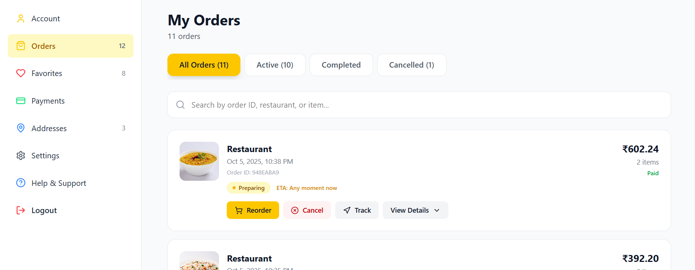

# Cravo

**Hungry? Tap, order, and get your cravings delivered!**

A full-stack, production-ready food delivery platform built with the MERN stack. Cravo enables users to explore restaurants, browse menus, place orders securely, and enjoy a seamless food delivery experience.

**Live Application:** [cravo.online](https://cravo.online)  
**Repository:** [github.com/believeharsh/Cravo](https://github.com/believeharsh/Cravo)

---

## Table of Contents

- [About](#about)
- [Features](#features)
- [Tech Stack](#tech-stack)
- [Screenshots](#screenshots)
- [Installation](#installation)
- [Configuration](#configuration)
- [Getting Started](#getting-started)
- [Project Structure](#project-structure)
- [Key Highlights](#key-highlights)
- [Future Enhancements](#future-enhancements)
- [Contributing](#contributing)
- [License](#license)

---

## About

Cravo is a comprehensive food delivery web application that provides users with an intuitive platform to discover restaurants, browse menus, and place orders. Built with modern web technologies and best practices, the application features advanced capabilities including AI-powered recommendations, secure payment processing, and real-time order management.

**Development Timeline:** 3 months  
**Project Type:** Solo Project

---

## Features

### User Experience

- Beautiful landing page with location-based search and interactive category filtering
- Smart location detection using IP-based geolocation for first-time visitors
- Top restaurants slider with trending establishments organized by category
- Fully responsive design optimized for desktop, tablet, and mobile devices

### Authentication & Security

- Secure manual authentication with password hashing
- Google OAuth integration for seamless sign-in
- Silent login system with automatic authentication using refresh tokens (30-day validity)
- Axios interceptors for token management
- Guest checkout capability for browsing and ordering without registration

### Restaurant & Menu Management

- Dedicated restaurant pages with complete menu viewing
- Advanced filtering options: price, delivery time, dietary preferences, best sellers, and ratings
- Infinite scroll loading for efficient restaurant browsing
- Dine-out feature supporting both delivery and dine-in services
- Category-specific result pages
- Coverage across 15+ cities with 1,500+ restaurants and 25,000+ products

### Cart & Checkout

- Secure cart functionality with real-time management via Redux Toolkit
- In-cart quantity control without page navigation
- PCI-compliant payment processing
- Guest checkout option
- Multiple delivery address management

### Personalization

- Comprehensive user dashboard with account management
- Favorites and wishlist functionality
- Address book management
- Payment method storage
- Complete order history with status tracking
- Default and custom wishlists for items and restaurants

### Payments & Notifications

- Razorpay integration supporting multiple payment methods
- Real-time email notifications for orders, offers, and account activities via Resend
- Dedicated offers and deals page
- Corporate partnership features

### AI & Smart Features

- AI-powered recommendations based on user activity and preferences
- Advanced search and filtering capabilities
- Personalized content delivery based on user behavior

### Support

- Comprehensive help and support center with FAQs
- Direct email support channel

---

## Tech Stack

### Frontend

- **React** - UI library for building interactive components
- **Tailwind CSS** - Utility-first CSS framework
- **Redux Toolkit** - State management
- **Axios** - HTTP client
- **React Router** - Client-side routing

### Backend

- **Node.js** - JavaScript runtime
- **Express.js** - Web application framework
- **MongoDB** - NoSQL database
- **Mongoose** - MongoDB object modeling

### External Services

- **Cloudinary** - Image and asset management
- **Razorpay** - Payment gateway
- **Resend** - Email service
- **Google Cloud** - OAuth 2.0 authentication

### Development Tools

- **Husky** - Git hooks
- **ESLint** - Code linting
- **Git** - Version control

### Deployment

- **Render** - Cloud hosting platform
- **Custom Domain** - cravo.online

---

## Screenshots

### Landing Page


### Restaurant Discovery


### Restaurant Menu


### Smart Cart


### Profile & Favorites


### Order History



### Address Management


### Offers & Deals


---

## Installation

### Prerequisites

- Node.js (v14 or higher)
- npm or yarn
- MongoDB instance
- Git

### Clone the Repository

```bash
git clone https://github.com/believeharsh/Cravo.git
cd Cravo
```

### Install Dependencies

```bash
npm install
```

---

## Configuration

Create `.env` files in both frontend and backend directories with the following configurations:

### Backend Environment Variables

```env
# Database
MONGODB_URI=your_mongodb_connection_string

# Cloudinary
CLOUDINARY_CLOUD_NAME=your_cloudinary_cloud_name
CLOUDINARY_API_KEY=your_cloudinary_api_key
CLOUDINARY_API_SECRET=your_cloudinary_api_secret

# Email Service (Resend)
RESEND_API_KEY=your_resend_api_key

# Payment Gateway (Razorpay)
RAZORPAY_KEY_ID=your_razorpay_key_id
RAZORPAY_KEY_SECRET=your_razorpay_key_secret

# Google OAuth
GOOGLE_CLIENT_ID=your_google_client_id
GOOGLE_CLIENT_SECRET=your_google_client_secret

# JWT
JWT_SECRET=your_jwt_secret_key
REFRESH_TOKEN_SECRET=your_refresh_token_secret

# Server
PORT=5000
NODE_ENV=development
```

### Frontend Environment Variables

```env
# API
VITE_API_URL=http://localhost:5000/api
VITE_RAZORPAY_KEY_ID=your_razorpay_key_id
VITE_GOOGLE_CLIENT_ID=your_google_client_id
```

### Setup Steps

1. Configure MongoDB connection string in backend `.env`
2. Create Cloudinary account and add credentials
3. Register for Resend email service and obtain API key
4. Create OAuth credentials in Google Cloud Console
5. Add Razorpay API keys for payment processing
6. Install dependencies in both frontend and backend directories

---

## Getting Started

### Development Mode

```bash
# Backend (from backend directory)
npm run dev

# Frontend (from frontend directory)
npm run dev
```

The application will be available at:

- Frontend: `http://localhost:5173`
- Backend: `http://localhost:5000`

### Code Quality

```bash
# Run ESLint
npm run lint

# Husky hooks run automatically on commit
```

### Production Build

```bash
# Frontend
npm run build

# Backend is production-ready as configured
```

---

## Project Structure

```
Cravo/
├── frontend/
│   ├── src/
│   │   ├── components/
│   │   ├── pages/
│   │   ├── redux/
│   │   ├── hooks/
│   │   ├── utils/
│   │   └── App.jsx
│   ├── tailwind.config.js
│   └── package.json
├── backend/
│   ├── routes/
│   ├── models/
│   ├── controllers/
│   ├── middleware/
│   ├── utils/
│   └── server.js
├── .gitignore
└── README.md
```

---

## Key Highlights

### Comprehensive Data Seeding

- 1,500+ restaurants across 15+ cities
- 25,000+ menu items with high-quality images
- Custom seeding scripts for efficient database initialization

### Advanced State Management

- Redux Toolkit for complex state handling
- Optimized re-render performance
- Real-time cart synchronization

### Production-Ready Authentication

- Secure password hashing
- JWT-based authentication with 30-day refresh tokens
- Automatic silent login via Axios interceptors
- OAuth 2.0 integration

### Scalable Architecture

- Modular component structure
- MVC pattern implementation
- Reusable utility functions
- Clean, maintainable codebase

### Code Quality Standards

- Husky integration for git hooks
- ESLint configuration
- Automated code formatting
- Best practices for error handling and validation

### User Experience Excellence

- Mobile-first responsive design
- Infinite scroll for performance optimization
- Optimized image loading via Cloudinary
- Intuitive navigation and information architecture

---

## Future Enhancements

- Real-time order tracking with GPS integration
- Restaurant dashboard for menu and order management
- Advanced analytics and personalized insights
- Push notifications for order updates
- Multi-language support (i18n)
- Comprehensive review system with photo uploads
- Loyalty program with points and rewards
- Centralized admin dashboard

---

## Contributing

This is a personal portfolio project. Feedback and suggestions are welcome. Feel free to open issues or reach out with recommendations.

---

## License

This project is open source and available under the MIT License.

---

**Built by Harsh Dahiya**

[GitHub](https://github.com/believeharsh) • [Live Demo](https://cravo.online) • [Repository](https://github.com/believeharsh/Cravo)

If you find this project interesting, please give it a star on GitHub.
